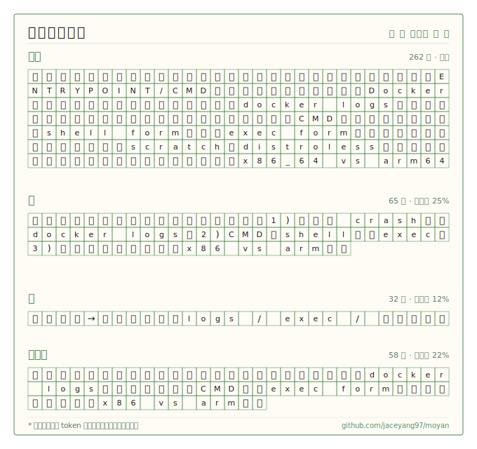

# 莫言 · moyan

中文写作省 70%+ token，质量不降。Claude Code 插件，三档级别：简 / 精 / 文言文。

[](https://github.com/jaceyang97/moyan/releases)
[](LICENSE)
[](https://claude.com/claude-code)

举个例子。问「我的 Docker 容器启动后立即退出，为什么？」：



## 安装

```bash
# marketplace（推荐）
/plugin marketplace add jaceyang97/moyan
/plugin install moyan@moyan

# 或本地 clone
git clone https://github.com/jaceyang97/moyan ~/.claude/plugins/moyan
```

装完 `/moyan` 启动，写 commit / 做 review / 答技术问题都按当前级别输出。只有安全警告、不可逆操作（删表、强推、覆盖文件）、多步顺序操作、用户说「详细点」时会自动恢复完整输出。

## 命令速查

| 命令 | 作用 |
|---|---|
| `/moyan` | 启动，默认「精」 |
| `/moyan 简` | 最省，适合正式文档 |
| `/moyan 文言文` | 文言文模式，debug / explain 最紧 |
| `/moyan 简体` / `/moyan 繁體` | 切字形 |
| `/moyan 繁體 文言文` | 字形 + 级别可组合 |
| `/moyan-help` | 速查卡 |
| `停止莫言` | 关闭 |

## Benchmark

71 条编程 prompt（4 难度 × 8 类别，53 训 18 holdout），Sonnet 4.6 跑五组对照（英文 normal、中文 normal、莫言三档），Opus 4.7 判官。output token 相对中文 normal 的省幅中位数：

| 级别 | 中位 | 均值 | 适合 |
|---|---|---|---|
| 简 | 73% | 67% | 正式文档、对外沟通 |
| 精（默认）| 74% | 66% | 日常开发问答 |
| 文言文 | **75%** | **68%** | debug、概念解释 |

文言文在 debug / explain / howto 多省 8-12pp（语法紧：没的/了/着、介词少、倒装允许）。commit 是例外 —— 需要 feat / fix 等英文关键字，文言文反而拖长，所以走 Conventional Commits 不压缩。


完整数字、per-category 表、autoskill 迭代日志、复现命令：[`benchmark/RESULTS_v2.md`](benchmark/RESULTS_v2.md) · [`benchmark/program.md`](benchmark/program.md)。

## 致谢

- [Julius Brussee / caveman](https://github.com/JuliusBrussee/caveman) —— 原作。这仓库的缘起是给 caveman 提了 PR [#76](https://github.com/JuliusBrussee/caveman/pull/76) 加中文支持，合得慢，索性单开一仓。

## License

MIT
