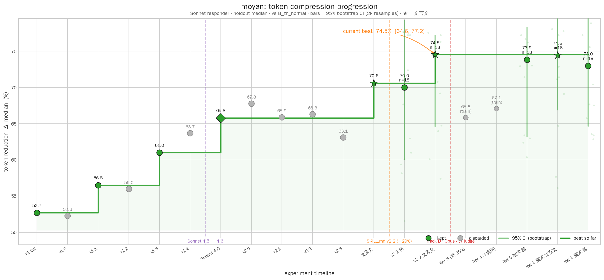

# 莫言 · moyan

中文省 token 模式，Claude Code plugin。受 [caveman](https://github.com/JuliusBrussee/caveman) 启发 —— caveman 用山顶洞人式英文压缩输出，moyan 以简洁中文做同件事。

三档级别（简 / 精 / 文言文）、简繁自适应、Claude Code 原生 skill 加载。

## 效果

输入：「为什么我这条 SQL 查询越来越慢？」

| 模式 | 回复 |
|------|------|
| 原始 | 随着数据量增长，查询变慢通常有几个原因。首先检查是否在 WHERE 子句的字段上建立了索引；如果没有索引，数据库需要全表扫描，在百万级数据下会非常慢。其次看执行计划（EXPLAIN），确认是否走了预期的索引。另外，JOIN 的顺序和选择性也会影响性能。 |
| 简 | 数据增长后几个常因：WHERE 字段无索引致全表扫描、执行计划未走预期索引、JOIN 顺序低效。先用 `EXPLAIN` 看计划。 |
| 精 | 三大常因：WHERE 无索引 → 全表扫描、执行计划走错索引、JOIN 顺序差。先 `EXPLAIN`。 |
| 文言文 | 查询愈慢，多缘全表之扫。先以 `EXPLAIN` 察其执行之道，加索引于 `WHERE` 之列，则速矣。 |

在 52 条编程问答上测 `claude-sonnet-4-6`，相对中文 normal baseline 的 output token 节省：

| 级别 | 中位 | 均值 | 适用 |
|---|---|---|---|
| 简 | 64% | 63% | 正式文档、对外沟通 |
| 精（默认）| 66% | 67% | 日常开发问答 |
| 文言文 | **71%** | **70%** | debug / explain / howto 类首选 |

文言文在最难压缩的类目（debug / explain / howto）反超精 8-12pp，因其语法天然更紧凑（无的/了/着、介词少、倒装允许）。例外：commit 类目 精 +9pp，Conventional Commits 需英文关键字，文言文反而拖长。

## 安装

```bash
# marketplace（推荐）
/plugin marketplace add jaceyang97/moyan
/plugin install moyan@moyan

# 或本地 clone
git clone https://github.com/jaceyang97/moyan ~/.claude/plugins/moyan
```

启用后通过 `/moyan` 激活：

```
/moyan            # 默认级别 精
/moyan 简         # 切级别
/moyan 文言文
/moyan 简体       # 切字形
/moyan 繁體
/moyan 繁體 文言文 # 可组合，顺序不限
停止莫言           # 关闭
```

激活后所有回复（含 commit / code review / 技术问答）按当前级别输出。以下场景自动暂停压缩、完整叙述后恢复：安全警告、不可逆操作确认（删表 / 强推 / 覆盖文件）、多步顺序指令、用户明确要求澄清。

## Benchmark

5 组对照（A 英文 normal / B 中文 normal / C-E 三档莫言）× 52 条 prompt（4 难度 × 8 类别），stratified 39 train / 13 holdout，盲评判官（Opus 4.6 跨家族判 Sonnet 4.6 响应）。



进展轨迹：手写迭代 v1 init 52.7% → v1 终态 61% → 模型升级 Sonnet 4.6 +4.8pp → 切文言文级别 +4.8pp。当前最高 **70.6%**。autoskill v2 四轮自动迭代全部 discard，证实当前 SKILL.md 在 Sonnet 4.6 上已达局部最优；进一步收益来自模型升级与级别切换，非新规则。

完整方法、per-category 数字、复现命令：[`benchmark/RESULTS_v2.md`](benchmark/RESULTS_v2.md)。v1 历史快照：[`RESULTS.md`](benchmark/RESULTS.md)。autoskill loop 设计：[`benchmark/program.md`](benchmark/program.md)。

## 仓库结构

```
moyan/
├── .claude-plugin/{plugin.json, marketplace.json}
├── skills/moyan/SKILL.md            # the artifact
├── benchmark/                       # eval + autoskill loop (autoresearch shape)
│   ├── program.md · evaluate.py     # agent-as-loop spec + scalar metric
│   ├── lib.py · run.py · judge.py   # infra
│   ├── plot.py                      # progression chart generator
│   ├── prompts.jsonl · splits/      # 52 prompts + train/holdout split
│   └── results.tsv · RESULTS{,_v2}.md
├── docs/progression.png
└── README.md · LICENSE
```

核心插件（`.claude-plugin/` + `skills/`）无脚本、无依赖、无 hooks。`benchmark/` 是开发工具，不参与插件运行。

## 致谢

- [Julius Brussee / caveman](https://github.com/JuliusBrussee/caveman) —— 原作。本仓库源于向原作者提的 PR [#76](https://github.com/JuliusBrussee/caveman/pull/76) 未合并。
- 莫言先生 —— 借名。

## License

MIT
